# Boutique E-Commerce App

A full-featured mobile shopping app built with React Native and Expo.

## Features
- Product listing and search
- Shopping cart and checkout flow
- Wishlist
- User Profile 
- Firebase Authentication (login/signup)
- Loyalty points system based on purchase amount
- Order tracking
- Admin panel for product and order management

## Tech Stack
- React Native
- Expo
- Firebase (Authentication)
- REST APIs
## Developer
Noor Fatima — CS Student
## Screenshots

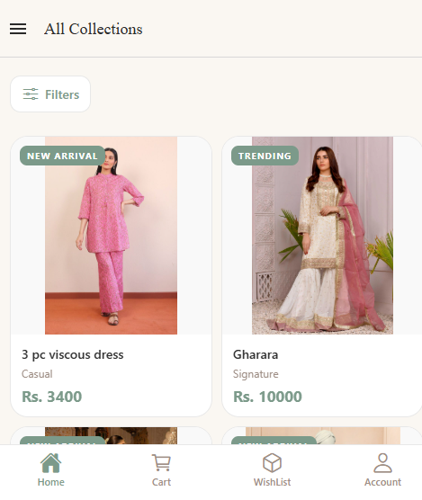
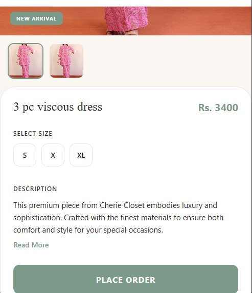
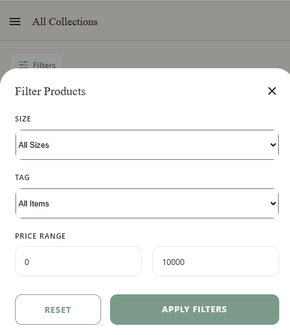
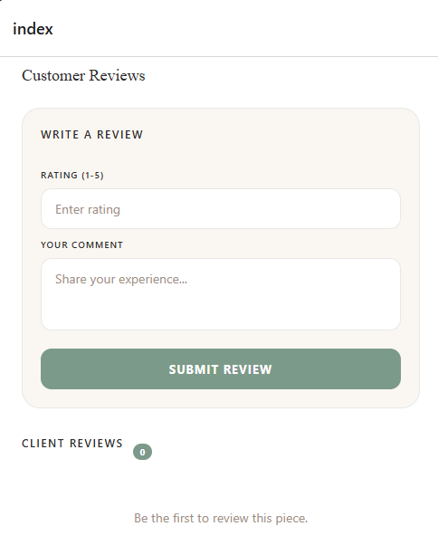

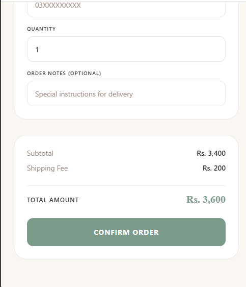

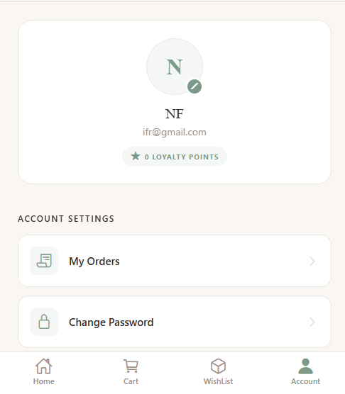
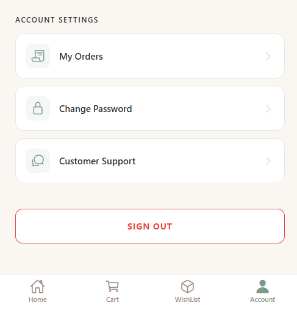
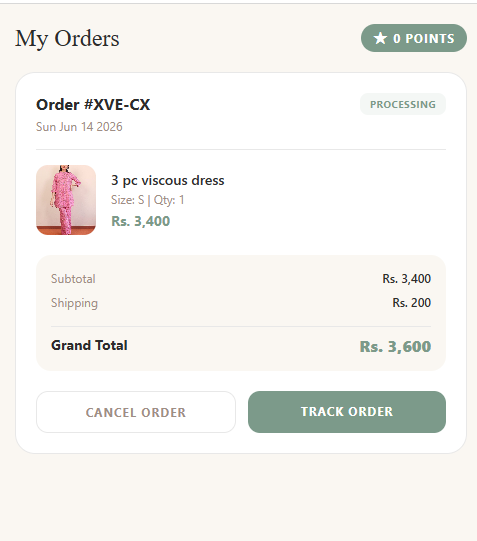
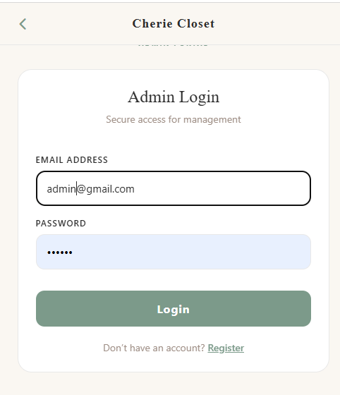
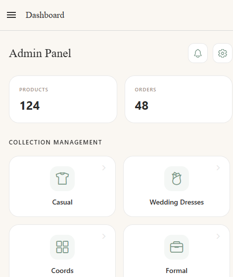
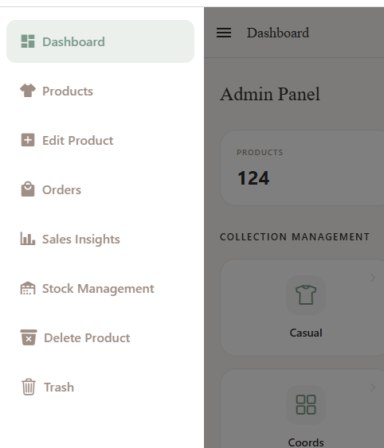
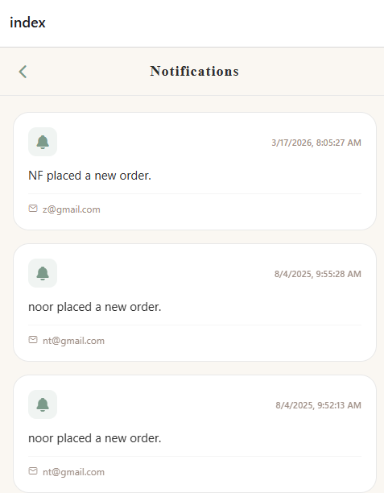
